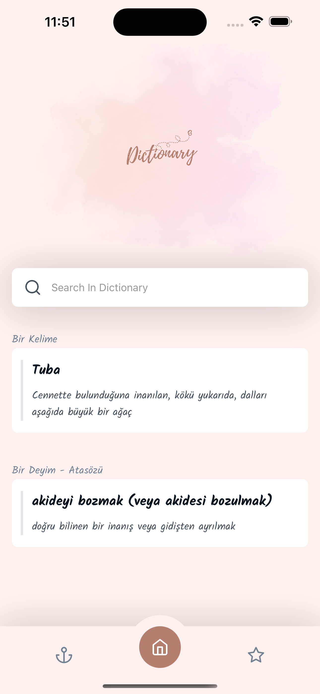
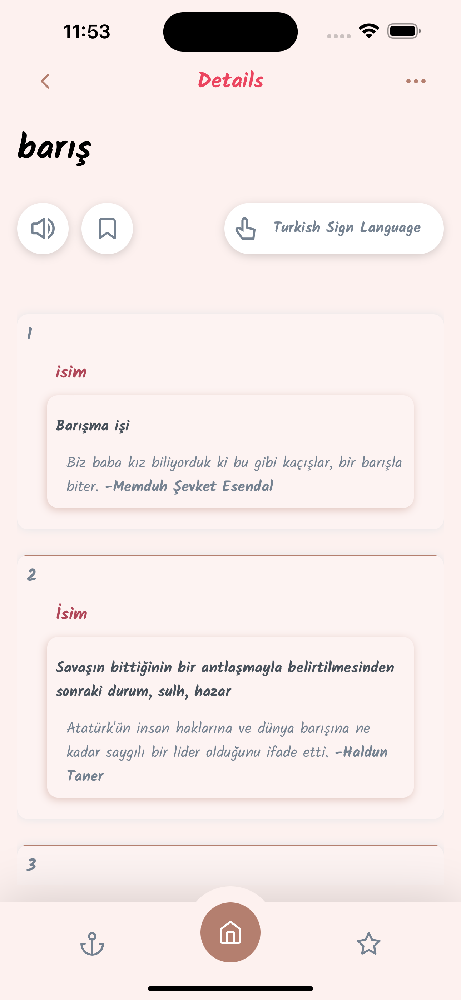

<h1>Turkısh Dictionary App - React Native</h1> 

<h2> This App created with React Native CLI </h2>   

<h3> WHICH LIBRARIES AND PACKAGES ARE USED IN THE APP? </h3>  

1. REACT NATIVE 
2. react-navigation  
3. svgr  
4. styled-components 
5. styled-system  

  

<strong> 

In this app;   You can search to show a word's mean.   I used real Turkish Language Community's official web site's data in this app.   And also, a different word and an expression or a proverb and their's mean show as a suggestion on the app's home page every single day.    

</strong> 

<h5> The project is not yet completed...  

Please stay tuned for more 😉 </h5>  

<!-- <h4> PROJECT APK LINK WILL BE ADDED </h4>   -->

<!-- [APK FILE DOWNLOAD LINK](https://github.com/habibecee/TodoApp-with-ReactNative/blob/master/assets/apk/app-release.apk) -->

<h3> APP VIEW </h3>  

  

| | |

||

 <!--|

||| -->
